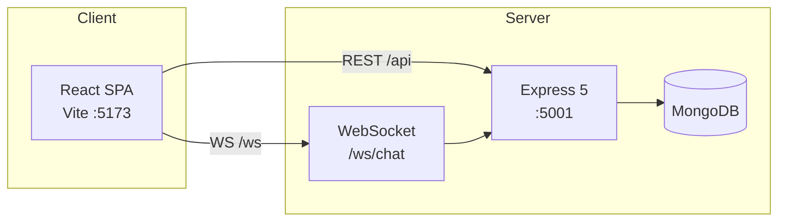
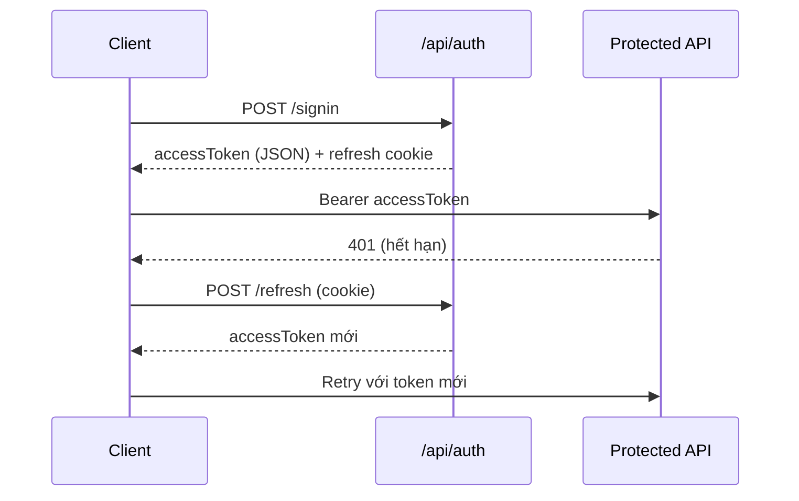

# Player Duo — Nền tảng tìm đồng chơi / thuê duo game

Dự án full-stack mô phỏng **hub thuê người chơi kèm rank** (phong cách PlayerDuo): đăng ký/đăng nhập, ví demo, đơn trở thành người cho thuê, admin duyệt, trang công khai người chơi, **ghép đồng đội bằng vector cosine**, trợ lý chat phân loại ý định, tin nhắn trực tiếp & hỗ trợ realtime qua WebSocket, bảng xếp hạng và bảng điều khiển quản trị.

---

## Mục lục

1. [Tính năng chính](#tính-năng-chính)
2. [Kiến trúc tổng quan](#kiến-trúc-tổng-quan)
3. [Yêu cầu môi trường](#yêu-cầu-môi-trường)
4. [Cài đặt & chạy local](#cài-đặt--chạy-local)
5. [Biến môi trường](#biến-môi-trường)
6. [Mô hình dữ liệu (MongoDB)](#mô-hình-dữ-liệu-mongodb)
7. [Định tuyến frontend](#định-tuyến-frontend)
8. [API backend](#api-backend)
9. [Thuật toán ghép đồng đội (Match Engine)](#thuật-toán-ghép-đồng-đội-match-engine)
10. [WebSocket — chat realtime](#websocket--chat-realtime)
11. [Luồng xác thực](#luồng-xác-thực)
12. [Quy tắc nghiệp vụ quan trọng](#quy-tắc-nghiệp-vụ-quan-trọng)
13. [Seed dữ liệu demo](#seed-dữ-liệu-demo)
14. [Admin & bootstrap tài khoản admin](#admin--bootstrap-tài-khoản-admin)
15. [Build production & triển khai](#build-production--triển-khai)
16. [Xử lý sự cố thường gặp](#xử-lý-sự-cố-thường-gặp)

---

## Tính năng chính

| Khu vực | Mô tả |
|---------|--------|
| **Hub công khai** | Trang chủ, Khám phá (lọc game/tìm kiếm/phân trang), bảng xếp hạng, trang `/players/:username` |
| **Tài khoản người dùng** | Đăng ký/đăng nhập JWT + refresh cookie, hồ sơ cá nhân, hồ sơ game, ví demo (nạp tiền) |
| **Người cho thuê (Provider)** | Gửi đơn đăng ký, admin duyệt, cấu hình listing (giá/giờ, rank, game, ảnh bìa), Provider Studio |
| **Thuê nhanh** | Trừ ví người thuê, cộng ví provider (trừ phí nền tảng), ghi booking |
| **Ghép đồng đội** | Vector đa nhãn (game + thể loại) + cosine similarity; gợi ý trên Khám phá; trợ lý chat NB |
| **Tin nhắn** | Chat trực tiếp giữa user; chat hỗ trợ user ↔ admin (WebSocket push) |
| **Đánh giá** | Review 1–5 sao trên trang công khai (mỗi cặp author/target một lần) |
| **Admin** | Dashboard, doanh thu, duyệt provider, quản lý user/seeker/hub listing, booking, tin nhắn hỗ trợ |

**Danh mục game hỗ trợ (10 game):** Valorant, LMHT, Tốc Chiến, PUBG Mobile, Free Fire, CS2, Apex Legends, Genshin Impact, Dota 2, Fortnite — định nghĩa tại `back-end/src/lib/gameTaxonomy.js`.

---

## Kiến trúc tổng quan



| Thành phần | Công nghệ | Vai trò |
|------------|-----------|---------|
| **Frontend** | Vite 8, React 18, TypeScript, Tailwind CSS 4, React Router 7, shadcn/ui, Sonner | SPA; proxy `/api` và `/ws` tới backend khi dev |
| **Backend** | Express 5 (ESM), Mongoose 9, JWT, bcrypt, cookie-parser, `ws` | REST API + WebSocket trên cùng cổng HTTP |
| **CSDL** | MongoDB | User, Session, Booking, Review, DirectMessage, SupportMessage |

**Luồng dev điển hình:**

- Frontend: `http://localhost:5173` — gọi API qua `/api/...` (Vite proxy → `5001`).
- Backend: `http://localhost:5001` — REST + WebSocket tại `/ws/chat`.

---

## Yêu cầu môi trường

- **Node.js** 18+ (khuyến nghị 20+ hoặc LTS; dự án đã kiểm tra với Node 22).
- **MongoDB** local (`mongodb://127.0.0.1:27017`) hoặc **MongoDB Atlas**.
- Hai terminal: một chạy backend, một chạy frontend.

---

## Cài đặt & chạy local

### 1. MongoDB

Đảm bảo MongoDB đang chạy. Database (ví dụ `playerduo`) sẽ tự tạo khi ứng dụng ghi dữ liệu lần đầu.

### 2. Backend

```bash
cd back-end
copy .env.example .env
# Chỉnh MONGODB_CONNECTION_STRING, ACCESS_TOKEN_SECRET trong .env
npm install
npm run dev
```

Khi thành công: `MongoDB connected successfully`, `Server is running on port 5001`.

### 3. Frontend

```bash
cd frontend
npm install
npm run dev
```

Mở trình duyệt: **http://localhost:5173**

### 4. (Tuỳ chọn) Seed người cho thuê demo

```bash
cd back-end
npm run seed:providers
```

Tạo **20 provider** (2 người/game). Mật khẩu mặc định: `Provider123` (hoặc `SEED_PROVIDER_PASSWORD` trong `.env`).

> **Lưu ý:** Nếu mở front bằng `http://127.0.0.1:5173`, đảm bảo `CORS_ORIGIN` trong `.env` backend có origin tương ứng.

---

## Biến môi trường

### Backend — `back-end/.env`

| Biến | Bắt buộc | Mô tả |
|------|-----------|--------|
| `MONGODB_CONNECTION_STRING` | Có | URI kết nối MongoDB |
| `ACCESS_TOKEN_SECRET` | Có | Chuỗi bí mật ký JWT access token |
| `PORT` | Không | Mặc định `5001` |
| `NODE_ENV` | Không | `development` / `production` |
| `CORS_ORIGIN` | Không | Danh sách origin cách nhau bởi dấu phẩy |
| `BOOTSTRAP_ADMIN_EMAIL` | Không | Email được gán **admin** mỗi lần start |
| `BOOTSTRAP_ADMIN_USERNAME` / `PASSWORD` / `DISPLAY_NAME` | Tuỳ chọn | Tạo admin mới lần đầu |
| `SEED_PROVIDER_PASSWORD` | Không | Mật khẩu tài khoản seed provider |

File mẫu: **`back-end/.env.example`**.

### Frontend — tuỳ chọn

| Biến | Khi nào cần | Mô tả |
|------|-------------|--------|
| `VITE_API_URL` | Build/preview trỏ API tuyệt đối | Ví dụ `https://api.example.com` |
| `VITE_GOOGLE_OAUTH_URL` | OAuth Google (chưa triển khai backend) | URL redirect OAuth; nếu trống, nút Google hiện toast "Đang phát triển" |
| *(mặc định trống)* | `npm run dev` | Dùng relative `/api` và `/ws` qua proxy Vite |

---


| Collection | File model | Ghi chú |
|------------|------------|---------|
| **User** | `models/user.js` | Hồ sơ, ví, listing, đơn provider, gaming profile |
| **Session** | `models/session.js` | Refresh token; TTL tự xóa khi hết hạn |
| **Booking** | `models/booking.js` | Giao dịch thuê; phí nền tảng mặc định 15% |
| **PlayerReview** | `models/playerReview.js` | Unique (authorId, targetUserId) |
| **DirectMessage** | `models/directMessage.js` | Cặp participantA/B đã sort ObjectId |
| **SupportMessage** | `models/supportMessage.js` | Thread theo threadUserId |

---

## Định tuyến frontend

| Path | Trang | Ghi chú |
|------|-------|---------|
| `/` | HomePage | Catalog, game hot, provider nổi bật |
| `/explore`, `/explore/game/:gameSlug` | ExplorePage | Danh sách provider + MatchSuggestions |
| `/players/:username` | PlayerPublicPage | Hồ sơ công khai, review, thuê nhanh |
| `/leaderboard` | LeaderboardPage | Bảng xếp hạng listing & xã hội |
| `/messages` | MessagesPage | Chat trực tiếp & hỗ trợ |
| `/profile/*` | ProfileLayout | Hub, account, wallet, gaming, listing, studio, become-provider |
| `/signin`, `/signup` | AuthLayout | Đăng nhập / đăng ký |
| `/admin/*` | AdminLayout | Chỉ user `role: admin` |

**Widget toàn cục (HubLayout):** `MatchAssistantChat` — trợ lý ghép đội nổi góc màn hình.

---

## API backend

Base path: **`/api`**. Các route bảo vệ cần header `Authorization: Bearer <accessToken>`.

### Auth — `/api/auth`

| Method | Path | Mô tả |
|--------|------|--------|
| POST | `/signup` | Đăng ký (username, password, email, displayName) |
| POST | `/signin` | Đăng nhập → `accessToken` + cookie refresh httpOnly |
| POST | `/refresh` | Lấy access token mới từ cookie |
| POST | `/signout` | Xóa session refresh |

Access token TTL: **30 phút**. Refresh token TTL: **14 ngày**.

### User (đã đăng nhập) — `/api/user`

| Method | Path | Mô tả |
|--------|------|--------|
| GET | `/me` | Thông tin user hiện tại |
| PATCH | `/profile` | displayName, bio, avatar, phone |
| PATCH | `/gaming-profile` | favoriteSlugs, playHistory |
| PATCH | `/player-listing` | Giá, rank, game, voice, live, … |
| PATCH | `/provider-studio` | Ảnh bìa listing |
| POST | `/wallet/top-up` | Nạp ví demo (VND) |
| POST | `/provider-application` | Gửi đơn trở thành provider |

### Catalog & listing (công khai)

| Method | Path | Mô tả |
|--------|------|--------|
| GET | `/api/catalog/home` | Stats, categories, featuredPlayers, hotGames |
| GET | `/api/listings` | Hub providers — query: `game`, `q`, `page`, `pageSize` |
| GET | `/api/listings/leaderboard` | BXH listing theo rating |
| GET | `/api/listings/leaderboards` | BXH xã hội: nạp tiền, chi tiêu thuê, thu nhập provider |
| GET | `/api/players/:username` | Hồ sơ công khai (ẩn email, phone, password) |

**Phân trang `GET /api/listings`:**

| Query | Mặc định | Giới hạn |
|-------|----------|----------|
| `page` | `1` | Tối đa 500 |
| `pageSize` | `12` | Tối đa 36 |

Response: `{ listings, total, page, pageSize, totalPages }`.

### Review — `/api/reviews`

| Method | Path | Mô tả |
|--------|------|--------|
| GET | `/player/:username` | Danh sách review công khai |
| POST | `/` | Tạo review (đăng nhập, 1–5 sao) |

### Thuê nhanh — `/api/rentals`

| Method | Path | Body | Mô tả |
|--------|------|------|--------|
| POST | `/quick` | `{ providerUsername, hours, gameSlug, platformFeePercent? }` | Trừ ví renter, cộng provider, tạo booking |

Ràng buộc: số dư đủ, provider hợp lệ, game nằm trong game provider hỗ trợ, giờ 0.25–500.

### Match / trợ lý — `/api/match`

| Method | Path | Mô tả |
|--------|------|--------|
| GET | `/taxonomy` | Danh mục game + genres + coverUrl |
| GET | `/suggestions` | Gợi ý ghép (đăng nhập) — query: `limit`, `minScore`, `wPref`, `wHist`, `wGenre` |
| POST | `/assistant` | Trợ lý chat — body: `{ message }` (≤800 ký tự) |

### Tin nhắn — `/api/messages`

| Method | Path | Mô tả |
|--------|------|--------|
| GET | `/conversations` | Danh sách hội thoại trực tiếp |
| GET | `/direct/:otherUserId` | Lịch sử chat với user |
| POST | `/direct` | Gửi tin — `{ toUserId? \| toUsername?, text }` |
| GET | `/support` | Thread hỗ trợ của user |
| POST | `/support` | Gửi tin hỗ trợ (user) |

### Admin — `/api/admin` (Bearer + `role: admin`)

| Method | Path | Mô tả |
|--------|------|--------|
| GET | `/dashboard-stats` | Thống kê tổng quan |
| GET | `/revenue-report` | Báo cáo doanh thu |
| GET | `/bookings` | Danh sách booking |
| POST | `/bookings` | Tạo booking thủ công |
| GET | `/providers` | Danh sách provider |
| PATCH | `/providers/:userId/revoke` | Thu hồi quyền provider |
| GET | `/users` | Tất cả user |
| GET | `/seekers` | Người thuê (renter) |
| GET | `/hub-listings` | Listing trên hub |
| GET | `/provider-applications` | Đơn đăng ký provider |
| PATCH | `/provider-applications/:userId` | Duyệt/từ chối đơn |
| GET | `/support-threads` | Danh sách thread hỗ trợ |
| GET | `/support-threads/:userId/messages` | Tin trong thread |
| POST | `/support-messages` | Admin trả lời hỗ trợ |

---

## Thuật toán ghép đồng đội (Match Engine)

Triển khai tại `back-end/src/lib/matchEngine.js`.

### Bước 1 — Vector hoá hồ sơ game

Mỗi user được biểu diễn bằng vector có độ dài cố định:

- **Chiều game:** `|ALLOWED_SLUGS|` = 10 (mỗi game một chiều).
- **Chiều thể loại:** `|GENRES|` = 6 (FPS, MOBA, BR, TacShooter, RPG, Casual).

Trọng số mặc định (có thể tuỳ chỉnh qua query):

| Thành phần | Trọng số | Nguồn dữ liệu |
|------------|----------|---------------|
| Sở thích (`preference`) | 45% | `gamingProfile.favoriteSlugs` |
| Lịch sử chơi (`playHistory`) | 35% | `hoursPlayed` chuẩn hoá theo max corpus |
| Lớp thể loại (`genreLayer`) | 20% | Trung bình các chiều game thuộc cùng genre |

Vector được **L2-normalize** trước khi so sánh.

### Bước 2 — Cosine similarity

Điểm ghép = dot product hai vector đã chuẩn hoá (tương đương cosine similarity). Kết quả trả về `scorePercent` (0–100) và `explanation` (game/genre trùng).

### Trợ lý chat (`POST /api/match/assistant`)

- Phân loại ý định bằng **Naive Bayes + softmax** (`intentClassifier.js`): `find_match`, `game_pick`, `price_info`, `leaderboard`, `general`.
- Trích xuất slug game từ câu hỏi.
- Khi đăng nhập: gọi match engine, trả top 5 gợi ý kèm reply tiếng Việt.

---

## WebSocket — chat realtime

- **Path:** `/ws/chat?token=<JWT_access>`
- **Dev (qua Vite):** `ws://localhost:5173/ws/chat?token=...`
- **Trực tiếp backend:** `ws://localhost:5001/ws/chat?token=...`

### Sự kiện push

| type | Người nhận | Mô tả |
|------|------------|--------|
| `support_message` | User của thread + mọi admin | Tin hỗ trợ mới |
| `direct_message` | Hai participant | Tin nhắn trực tiếp mới |

Triển khai: `back-end/src/lib/chatWs.js`, hook `frontend/src/hooks/useSupportWebSocket.ts`.

---

## Luồng xác thực



1. **Đăng nhập:** nhận `accessToken` + cookie httpOnly refresh.
2. **Gọi API:** `apiFetch` (`frontend/src/lib/api.ts`) gửi Bearer từ `localStorage`.
3. **401:** tự thử refresh một lần; thất bại thì xóa token.
4. **Đăng xuất:** `POST /api/auth/signout` + xóa `localStorage`.

---

## Quy tắc nghiệp vụ quan trọng

### Hiển thị trên hub (Khám phá, trang chủ, leaderboard listing)

Chỉ user thỏa **cả hai** điều kiện:

- `accountType === "provider"` (đã duyệt đơn).
- `role !== "admin"` (admin không xuất hiện hub công khai).

Logic: `hubProviderAccountQuery()` trong `back-end/src/lib/listingMappers.js`.

### Đơn trở thành provider

1. User gửi đơn → `providerApplication.status = "pending"`.
2. Admin duyệt → `approved`, `accountType = "provider"`, copy giá/game vào `playerListing`.
3. Admin từ chối → `rejected`.

### Thuê nhanh

- Trừ `walletBalanceVnd` người thuê.
- Cộng provider sau khi trừ `platformFeePercent` (mặc định 15%).
- Ghi `Booking` với `source: "quick_rent"`, `status: "completed"`.
- Cập nhật `featuredGameSlug` provider theo thống kê thuê.

### Ví demo

Nạp tiền qua `POST /api/user/wallet/top-up` — không kết nối cổng thanh toán thật; phục vụ demo và bảng xếp hạng nạp tiền.

---

## Seed dữ liệu demo

```bash
cd back-end
npm run seed:providers
```

- Tạo 20 tài khoản provider (2 người × 10 game).
- Username dạng `{game}-pro-1`, `{game}-pro-2`.
- Mật khẩu: `Provider123` hoặc `SEED_PROVIDER_PASSWORD`.
- Script: `back-end/src/scripts/seedProviders.js`.

---

## Admin & bootstrap tài khoản admin

File `back-end/src/lib/bootstrapAdmin.js` chạy mỗi lần server start:

- **Cách A:** `BOOTSTRAP_ADMIN_EMAIL` — gán `role: admin` cho email đã tồn tại.
- **Cách B:** Thêm username + password → tạo admin mới nếu chưa có.

UI admin: `/admin`, `/admin/dashboard`, Doanh thu, Providers, Hub listings, Users, Seekers, Messages.

---

## Build production & triển khai

### Frontend

```bash
cd frontend
# Tuỳ chọn: set VITE_API_URL=https://api.yourdomain.com
npm run build
```

Output: `frontend/dist/`. Phục vụ tĩnh (nginx, S3, Vercel, …).

### Backend

```bash
cd back-end
npm start
```

Biến bắt buộc: `MONGODB_CONNECTION_STRING`, `ACCESS_TOKEN_SECRET`, `NODE_ENV=production`, `CORS_ORIGIN` trỏ domain frontend.

### Reverse proxy (nginx gợi ý)

```nginx
location /api/ {
    proxy_pass http://127.0.0.1:5001;
}

location /ws {
    proxy_pass http://127.0.0.1:5001;
    proxy_http_version 1.1;
    proxy_set_header Upgrade $http_upgrade;
    proxy_set_header Connection "upgrade";
}
```

Khi front chạy HTTPS, WebSocket dùng **`wss://`** — `getWsChatUrl` trong `frontend/src/lib/api.ts` xử lý theo protocol.

---

## Xử lý sự cố thường gặp

| Hiện tượng | Hướng xử lý |
|------------|-------------|
| Front không kết nối API | Backend chạy cổng **5001**; frontend dùng `npm run dev` để có proxy `/api`. |
| CORS / cookie không vào | Đồng bộ origin trong `CORS_ORIGIN`; tránh lẫn `localhost` vs `127.0.0.1`. |
| MongoDB lỗi kết nối | Kiểm tra URI, firewall, IP whitelist (Atlas). |
| Backend crash khi start | Thiếu `.env` hoặc lỗi import; chạy `node --check src/server.js`. |
| WebSocket không nhận tin | Kiểm tra proxy `/ws` Vite; token còn hạn; log JWT backend. |
| Không thấy user trên Khám phá | User phải `accountType: provider` và đã duyệt; admin không hiện hub. |
| Gợi ý ghép trống | Cập nhật **Hồ sơ → Gaming** (favoriteSlugs, playHistory); hạ `minScore` trên UI MatchSuggestions. |
| Seed báo trùng username | Script bỏ qua user đã tồn tại — bình thường khi chạy lại. |

---

## License & đóng góp

Dự án mang tính học tập / đồ án (`doancoso`). Tuỳ chỉnh README theo tên nhóm, giảng viên hướng dẫn và phiên bản báo cáo.

**Tham chiếu nhanh file quan trọng:**

| Chức năng | Backend | Frontend |
|-----------|---------|----------|
| Server & routes | `src/server.js` | `src/App.tsx` |
| Auth | `Controllers/AuthController.js` | `contexts/AuthContext.tsx` |
| Match engine | `lib/matchEngine.js` | `components/match/MatchSuggestions.tsx` |
| Trợ lý chat | `Controllers/matchController.js` | `components/match/MatchAssistantChat.tsx` |
| Hub listing | `Controllers/listingController.js` | `pages/ExplorePage.tsx` |
| WebSocket | `lib/chatWs.js` | `hooks/useSupportWebSocket.ts` |
| API client | — | `lib/api.ts` |
